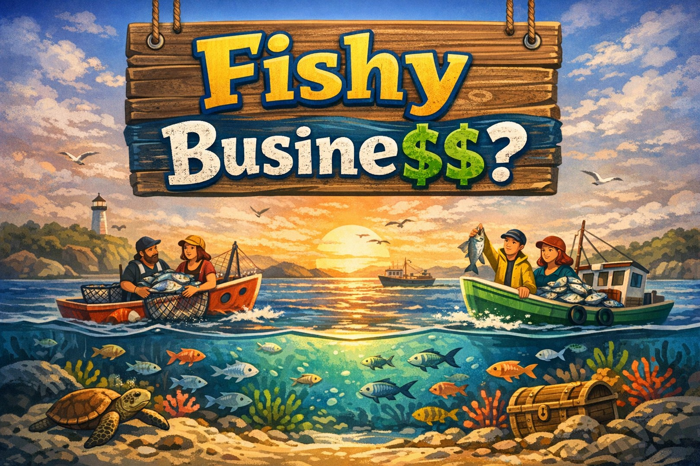

# Fishy Busine\$\$ - Eine Umsetzung des Harvest-Spiels

„Fishy Busine\$\$“ ist ein Gruppenspiel (20 bis 30 Schüler\*innen) rund um einen gemeinsamen Fischbestand im Ozean. Es ist eine verinfachte Umsetzung des ursprünglich von Meadows et al. (1993) erdachten "Fish Banks" Spiel. Die Spielmechanik entspricht der des "Harvest"-Spiels (z.B. Meadows et al., 2016; Sweeney & Meadows, 2010). In diesem Spiel übernehmen mehrere Teams die Rolle von Fischereibetrieben und entscheiden in jeder Runde, wie viele Fische sie fangen wollen. Nach jeder Runde regeneriert sich der Fischbestand, jedoch nur bis zu einer Obergrenze von 50 Fischen. Die Spieldynamik macht erlebbar, dass kurzfristiges, übermäßiges Fischen den Bestand schrumpfen lässt und langfristig allen schadet, während Kooperation eine nachhaltige Nutzung ermöglicht.

Die Aufbereitung des Spiels und der begleitenden Unterlagen richtet sich im österreichischen Schulsystem an folgende Zielgruppen:

-   Schüler\*innen ab der 11 Schulstuft AHS;

-   Schüler\*innen ab der 12 Schulstufe BHS.

## 🗂️ Inhalte

-   `50_fish.docx` - Druckvorlage für die Fische (50 Fische pro Seite)
-   `fb_cover_v3_1090.jpg` - Coverbild für die Materialien[^1]
-   `Fishy_Business_v2-1.docx` - Kurzbeschreibung des Spiels (inkl. Zielgruppe, Ablauf und Lernziele)
-   `fishy_busnie\$\$\_v1.pptx` - PowerPoint slides (.pptx) für die Durchführung des Spiels
-   `protokolls_harvest_game_v1.xlsx` - Excel-Tabelle zur Protokollierung der Spielrunden (inkl. Fischbestand, Fangmengen, etc.)

[^1]: Das Titelbild wurde mittels Academic AI (GPT Image 1.5) und folgendem Prompt erstellt: \> ich habe diese beschreibung eines simulationsspiels namens Fish Busine\$\$: \> \> Fishy Busine\$\$? – Ein Spiel zur nachhaltigen Ressourcennutzung \> \> Kurzbeschreibung des Spiels: „Fishy Business“ ist ein Gruppenspiel (20 bis 30 Schüler\*innen) r& um einen gemeinsamen Fischbestand im Ozean. Mehrere Teams übernehmen die Rolle von Fischereibetrieben & entscheiden in jeder R&e, wie viele Fische sie fangen wollen. Nach jeder R&e regeneriert sich der Fischbestand, jedoch nur bis zu einer Obergrenze von 50 Fischen. Die Spieldynamik macht erlebbar, dass kurzfristiges, übermäßiges Fischen den Bestand schrumpfen lässt & langfristig allen schadet, während Kooperation eine nachhaltige Nutzung ermöglicht. Zielgruppe 11 & 12 Schulstufe AHS; 12 & 13 Schulstufe BHS Spielablauf & -dauer: Nach einer kurzen inhaltlichen Einführung werden vier Phasen durchlaufen: · R&e 1: Die Teams spielen mehrere R&en durch & erleben direkt die Folgen unterschiedlicher Strategien. Häufig kommt es zu Übernutzung, Konkurrenz & sinkenden Fangerträgen. · Inhaltlicher Input: Gemeinsam wird besprochen, was nachhaltige Ressourcennutzung bedeutet, wie sich Ökosysteme regenerieren & warum gerechte Verteilung, Rücksichtnahme & Kooperation zentrale Elemente einer nachhaltigen Ressourcennutzung sind. Beispiele aus dem Alltag (z. B. Wasser, Boden, Energie) werden einbezogen. · R&e 2: Nun spielen die Teams erneut – diesmal mit dem erworbenen Wissen über Nachhaltigkeit. Sie können versuchen, kooperativ zu handeln & stabile Fangmengen über längere Zeit sicherzustellen. · Reflexion: Anhand von Leitfragen wird die Spielerfahrung diskutiert & in den bereiten Kontext nachhaltiger Ressourcennutzung eingeordnet. Als Spieldauer werden 2 (bis 2,5) St&en empfohlen. Lernziele Die Schülerinnen & Schüler erleben das Prinzip nachhaltiger Ressourcennutzung anhand eines einfachen Spiels & erkennen ihre Rolle in gemeinschaftlichen Entscheidungssituationen. Die Einheit unterstützt zentrale Ziele der Bildung für nachhaltige Entwicklung (BNE): vorausschauendes Denken, Verantwortungsbewusstsein, Kooperationsfähigkeit & das Verständnis ökologischer Zusammenhänge. \> \> kannst du mir für eine Präsentation ein passenden titelbild dazu genereieren, ohne dabei im bild die Wörter fischbestand, überfischung & nachhaltige kooperation zu gebrauchen. Benutze auch keine pfeile im Bild. Beim titel füge nach fishy einen zeilenumbruch ein

## 🌍 Danksagung

Ich möchte mich besonders bei [Emmerich Haimer](https://www.fhwn.ac.at/mitarbeiter/haimer-emmerich) von der [FH Wiener Neustadt](https://www.fhwn.ac.at/) bedanken, ohne den ich bis heute nicht wüsste, dass es Fish Banks und das Harvest-Spiel überhaupt gibt. Auf ihn geht auch die Idee zurück, [Elinor Ostroms Gestaltungsprinzipien für Gemeingüter](https://www.hfwu.de/fileadmin/user_upload/ZNE/Veranstaltungen/Herbstworkshops/2014/Gestaltungsprinzipien_fuer_Gemeingueter_nach_Elinor_Ostrom.pdf) im inhaltlichen Input zwischen den zwei Spieldurchgängen zu behandeln.

------------------------------------------------------------------------

## 📜 Metadaten

-   **Title:** Fishy Busine\$\$ - Eine Umsetzung des Harvest-Spiels
-   **Author(s):** Kami Höferl
-   **Institution:** IMC University of Applied Sciences Krems
-   **Language:** German
-   **License:** [CC BY 4.0](https://creativecommons.org/licenses/by/4.0/)
-   **Version:** v1.0
-   **DOI:** [doi.org/10.5281/zenodo.20638316](https://doi.org/10.5281/zenodo.20638316)
-   **Keywords:** Commons, Nachhaltigkeit, Game-based Learning, Bildung für nachhaltige Entwicklung, Simulation, Ressourcenmanagement

## 🔄 Lizenz & Weiterverwendung

Alle Materialien in diesem Repository sind – sofern nicht anders angegeben – unter der Creative Commons Namensnennung 4.0 International (CC BY 4.0) lizenziert. Es ist gestattet:

-   **Teilen** – das Material in jedwedem Format oder Medium vervielfältigen und weiterverbreiten
-   **Bearbeiten** – das Material remixen, verändern und darauf aufbauen, und zwar für beliebige Zwecke, auch kommerziell
-   **Namensnennung erforderlich** - Bitte die Autorinnen nennen, einen Link zur Lizenz angeben und kenntlich machen, ob Änderungen vorgenommen wurden.

## 🙋 Beiträge & Feedback

**Für die Github-Nerds:** Issues oder Pull Requests sind herzlich willkommen, wenn ihr Verbesserungen, Korrekturen oder Übersetzungen vorschlagen möchtet.

**Für alle anderen:** Bei Feedback, Fragen oder Anregungen zu den Materialien bitte per [E-Mail](mailto:kamibastelt@posteo.de) melden.

## 📚 Literatur

Meadows, D. L., Sweeney, L. B., & Martin-Mehers, G. (2016). The climate change playbook: 22 systems thinking games for more effective communication about climate change. Chelsea Green Publishing.

Meadows, D. L., Fiddaman, T., & Shannon, D. (1993). *Fish Banks, LTD - G*ame Administrator’s and  Materials Manuals. University of New Hampshire.

Sweeney, L. B., & Meadows, D. L. (2010). The systems thinking playbook: Exercises to stretch and build learning and systems thinking capabilities (1st edn). Chelsea Green Publishing.